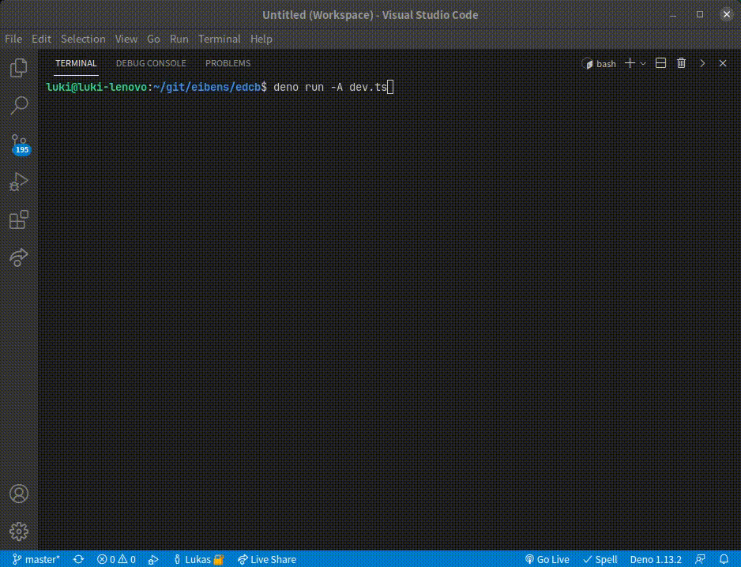

# [edcb]

[edcb] is a build tool and task runner for Deno. It has support for formatting,
linting, testing, code coverage, bundling, and more, and it can be used via
command line or TypeScript import.

[![License][license-shield]](LICENSE)
[![Deno module][deno-land-shield]][deno-land]
[![Github
tag][github-shield]][github] [![Build][build-shield]][build]
[![Code
coverage][coverage-shield]][coverage]



# CLI

The [edcb] CLI can be installed with [Deno].

```sh
deno install -f -A https://deno.land/x/edcb/cli.ts
```

After installation, building a project is as simple as running [edcb] in the
project root.

```sh
edcb
```

## `--ci`

The `--ci` flag changes the behavior as follows:

1. Runs the [Deno] formatter with the `--check` flag.
2. Generates a test coverage file.
3. Uploads the test coverage file to [codecov.io]. This step likely fails on
   local systems.

```sh
edcb --ci
```

## `--debug`

The `--debug` flag can be used to display sub-process output. Per default, the
output is only logged if the process failed. For example, a developer may use
the flag to see the full code coverage report in order to write tests for the
missing lines.

```sh
edcb --debug
```

## `--ignore`

The `--ignore` option can be used to ignore files and directories. It has the
same format as the `--ignore` option of `deno fmt` and `deno lint`.

```sh
edcb --ignore=deps,docs
```

# Configuration

[edcb] can be configured with TypeScript. See the [dev.ts](dev.ts) module for an
example. Import the `createEdcb` function and call one of its methods with
custom options. For example, one can specify the `ignore` option, which will
then be used if the `--ignore` option was not provided:

```ts
// NOTE: Change this URL to a specific version of edcb.
import { createEdcb } from "./mod.ts";

// Create an instance.
const edcb = createEdcb();

// Run the build action.
await edcb.build({
  // Specify options.
  ignore: "deps",
});
```

**TODO(not implemented):** When `edcb` is run in a folder with a `dev.ts` file,
it will pass the arguments to `deno run -A dev.ts` instead. This prevents a
developer from accidentally building a project with a local [edcb] version that
differs from the version defined in `dev.ts`. The GitHub Actions workflow file
also runs `dev.ts` to avoid this problem.

[edcb]: #
[Deno]: https://deno.land
[GitHub Actions]: https://github.com/features/actions
[codecov.io]: https://codecov.io

<!-- badges -->

[github]: https://github.com/eibens/edcb
[github-shield]: https://img.shields.io/github/v/tag/eibens/edcb?label&logo=github
[coverage-shield]: https://img.shields.io/codecov/c/github/eibens/edcb?logo=codecov&label
[license-shield]: https://img.shields.io/github/license/eibens/edcb?color=informational
[coverage]: https://codecov.io/gh/eibens/edcb
[build]: https://github.com/eibens/edcb/actions/workflows/ci.yml
[build-shield]: https://img.shields.io/github/workflow/status/eibens/edcb/ci?logo=github&label
[deno-land]: https://deno.land/x/edcb
[deno-land-shield]: https://img.shields.io/badge/x/edcb-informational?logo=deno&label
